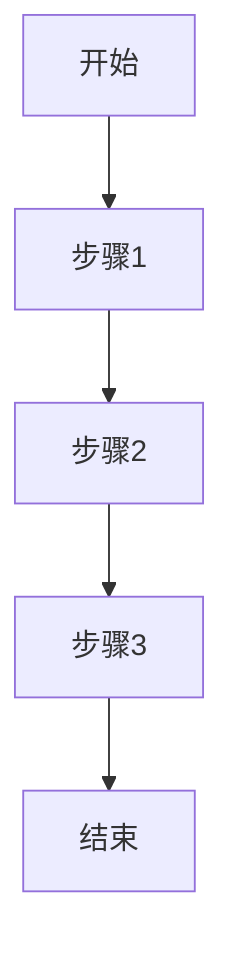

# 阶段二：核心功能实现

## 目标

实现项目的核心业务功能，完成主要用户场景的支撑。

## 需求分析

### 本阶段功能列表

1. **[功能1名称]**
   - 优先级：[P0/P1/P2]
   - 复杂度：[高/中/低]
   - 依赖：[依赖项]

2. **[功能2名称]**
   - 优先级：[P0/P1/P2]
   - 复杂度：[高/中/低]
   - 依赖：[依赖项]

3. **[功能3名称]**
   - 优先级：[P0/P1/P2]
   - 复杂度：[高/中/低]
   - 依赖：[依赖项]

### 用户场景

1. **[场景1名称]**
   - 用户目标：[目标]
   - 操作步骤：[步骤]
   - 预期结果：[结果]

2. **[场景2名称]**
   - 用户目标：[目标]
   - 操作步骤：[步骤]
   - 预期结果：[结果]

## 技术方案

### 核心模块设计

#### [模块1名称]

**职责**：[职责描述]

**接口设计**：

```python
[接口定义]
```

**实现要点**：
1. [要点1]
2. [要点2]
3. [要点3]

#### [模块2名称]

**职责**：[职责描述]

**接口设计**：

```python
[接口定义]
```

**实现要点**：
1. [要点1]
2. [要点2]
3. [要点3]

### 数据模型

#### [模型1名称]

```python
[模型定义]
```

**字段说明**：
- [字段1]：[类型] - [说明]
- [字段2]：[类型] - [说明]
- [字段3]：[类型] - [说明]

#### [模型2名称]

```python
[模型定义]
```

**字段说明**：
- [字段1]：[类型] - [说明]
- [字段2]：[类型] - [说明]
- [字段3]：[类型] - [说明]

### 业务流程

#### [流程1名称]



**流程说明**：
1. [步骤1说明]
2. [步骤2说明]
3. [步骤3说明]

#### [流程2名称]


**流程说明**：
1. [步骤1说明]
2. [步骤2说明]
3. [步骤3说明]

## 实现步骤

### 步骤 1：实现[功能1名称]

**需求描述**：[需求详细描述]

**实现代码**：

```python
[代码实现]
```

**关键点**：
1. [关键点1]
2. [关键点2]
3. [关键点3]

**测试用例**：

```python
[测试代码]
```

### 步骤 2：实现[功能2名称]

**需求描述**：[需求详细描述]

**实现代码**：

```python
[代码实现]
```

**关键点**：
1. [关键点1]
2. [关键点2]
3. [关键点3]

**测试用例**：

```python
[测试代码]
```

### 步骤 3：实现[功能3名称]

**需求描述**：[需求详细描述]

**实现代码**：

```python
[代码实现]
```

**关键点**：
1. [关键点1]
2. [关键点2]
3. [关键点3]

**测试用例**：

```python
[测试代码]
```

## 关键决策

### 决策 1：[决策名称]

**问题**：[问题描述]

**选项**：
- 选项 A：[描述]
- 选项 B：[描述]

**选择**：[选择的选项]

**理由**：
1. [理由1]
2. [理由2]
3. [理由3]

### 决策 2：[决策名称]

**问题**：[问题描述]

**选项**：
- 选项 A：[描述]
- 选项 B：[描述]

**选择**：[选择的选项]

**理由**：
1. [理由1]
2. [理由2]
3. [理由3]

## 验证方法

### 功能验证

1. **[功能1名称]**
   - 测试用例：[用例描述]
   - 测试步骤：[步骤]
   - 预期结果：[结果]

2. **[功能2名称]**
   - 测试用例：[用例描述]
   - 测试步骤：[步骤]
   - 预期结果：[结果]

### 集成验证

1. **[集成场景1]**
   - 测试步骤：[步骤]
   - 预期结果：[结果]

2. **[集成场景2]**
   - 测试步骤：[步骤]
   - 预期结果：[结果]

### 性能验证

1. **[性能指标1]**
   - 测试方法：[方法]
   - 目标值：[值]
   - 实测值：[值]

2. **[性能指标2]**
   - 测试方法：[方法]
   - 目标值：[值]
   - 实测值：[值]

## 常见问题

### 问题 1：[问题描述]

**现象**：[现象描述]

**原因**：[原因分析]

**解决方案**：[解决方法]

### 问题 2：[问题描述]

**现象**：[现象描述]

**原因**：[原因分析]

**解决方案**：[解决方法]

## 下一步

本阶段完成后，可以进入[阶段三：功能扩展与优化]，开始实现次要功能和性能优化。
